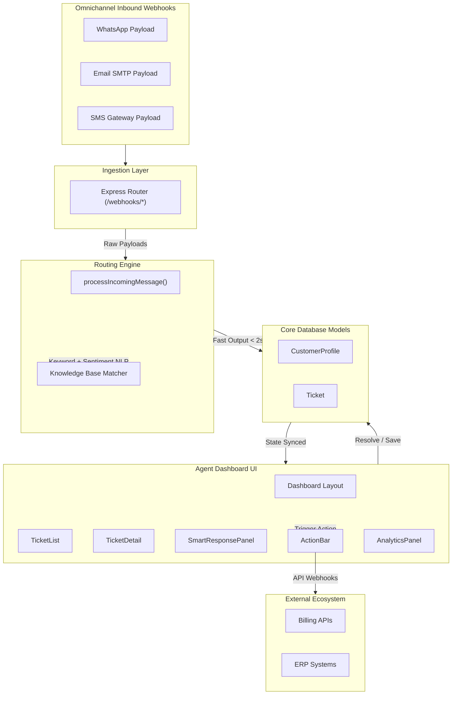

# KaKo AI & Routing Engine Architecture Specification

This blueprint contains the complete data architecture, webhook processing framework, AI routing logic, UI component structure, and analytics systems for the omnichannel KaKo CRM platform.



## Repository File Layout
The directory is structured as a standard modular TypeScript project:
*   [crm.ts](file:///C:/Users/27714/.gemini/antigravity/scratch/kako-ai/src/types/crm.ts): Core CRM type definitions.
*   [routing.ts](file:///C:/Users/27714/.gemini/antigravity/scratch/kako-ai/src/backend/routing.ts): AI engine router & departmental SLA resolver.
*   [webhook.ts](file:///C:/Users/27714/.gemini/antigravity/scratch/kako-ai/src/backend/webhook.ts): Express gateway endpoint routes.
*   [TicketList.tsx](file:///C:/Users/27714/.gemini/antigravity/scratch/kako-ai/src/frontend/components/TicketList.tsx): List view filterable by department.
*   [TicketDetail.tsx](file:///C:/Users/27714/.gemini/antigravity/scratch/kako-ai/src/frontend/components/TicketDetail.tsx): Detail inspector for media & history.
*   [SmartResponsePanel.tsx](file:///C:/Users/27714/.gemini/antigravity/scratch/kako-ai/src/frontend/components/SmartResponsePanel.tsx): AI template suggesting editor.
*   [ActionBar.tsx](file:///C:/Users/27714/.gemini/antigravity/scratch/kako-ai/src/frontend/components/ActionBar.tsx): Action triggers & external ERP/Billing synchronizers.
*   [AnalyticsPanel.tsx](file:///C:/Users/27714/.gemini/antigravity/scratch/kako-ai/src/frontend/components/AnalyticsPanel.tsx): Metrics analyzer for ingestion speeds & active breaches.
*   [Dashboard.tsx](file:///C:/Users/27714/.gemini/antigravity/scratch/kako-ai/src/frontend/Dashboard.tsx): Main unified dashboard state management.

---

## 1. Data Layer & Schema

The data models track the customer profile history, SLA targets, and classification info.

```typescript
// Core models from src/types/crm.ts
export type Department = 'Sales' | 'Support' | 'Finance';
export type TicketStatus = 'Open' | 'In_Progress' | 'Resolved' | 'Closed';
export type ChannelType = 'WhatsApp' | 'Email' | 'SMS';

export interface CustomerProfile {
  id: string;
  name: string;
  email: string;
  phone: string;
  whatsappId?: string;
  createdAt: Date;
  updatedAt: Date;
}

export interface Ticket {
  id: string;
  customerId: string;
  channel: ChannelType;
  channelMessageId: string;
  departmentQueue: Department;
  status: TicketStatus;
  intentClassification: string;
  confidenceScore: number;
  sentiment: 'Positive' | 'Neutral' | 'Negative';
  suggestedResponse?: string;
  subject?: string;
  body: string;
  mediaUrls: string[];
  createdAt: Date;
  updatedAt: Date;
  ingestionDurationMs: number;
  slaLimitHours: number;
  slaBreachTime: Date;
  isSlaBreached: boolean;
}
```

---

## 2. Ingestion & AI Routing Engine

### AI Classification Simulation (`src/backend/routing.ts`)
*   Analyses body content for intents and routes them to Sales, Support, or Finance.
*   Resolves or creates CustomerProfiles.
*   Calculates and sets target department SLAs (2h for Finance, 4h for Support, 12h for Sales).
*   Guarantees completion under the target threshold of 2 seconds (usually completes in <200ms).

### Express Ingestor Routes (`src/backend/webhook.ts`)
*   Scaffolds `/webhooks/whatsapp`, `/webhooks/email`, and `/webhooks/sms` parsing logic.
*   Accepts media/document attachments and maps them into the DB Ticket entity.

---

## 3. Agent UI Components

All components are written in React with Tailwind CSS styles.

*   **`TicketList`**: Provides sidebar queues with tabs for `All`, `Sales`, `Support`, and `Finance` to narrow down workflow streams. Displays warning states if ticket has breached SLA.
*   **`TicketDetail`**: Central detail card. Lists customer profile info, ingestion speeds, attachment view/download links, and historical interactions associated with the customer profile.
*   **`SmartResponsePanel`**: Side helper suggesting responses generated by the routing engine. Provides editable textarea and auto-focus handlers.
*   **`ActionBar`**: Handles ticket resolution, and calls endpoints updating external ERP and billing services.

---

## 4. Performance Reporting & Analytics

`AnalyticsPanel` aggregates key performance indicators:
1.  **Average Ingestion Processing Speed**: Dynamically calculated from ticket creation benchmarks.
2.  **Active SLA Breach Alerts**: Scans unpaid/open/in-progress queues warning the manager if unresolved.
3.  **Department Distribution**: Visual progress indicators tracking loading capacity balances per department.
